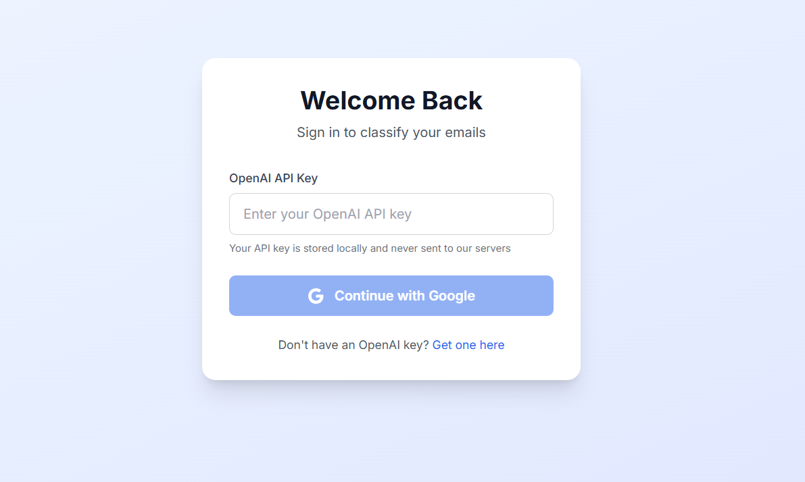
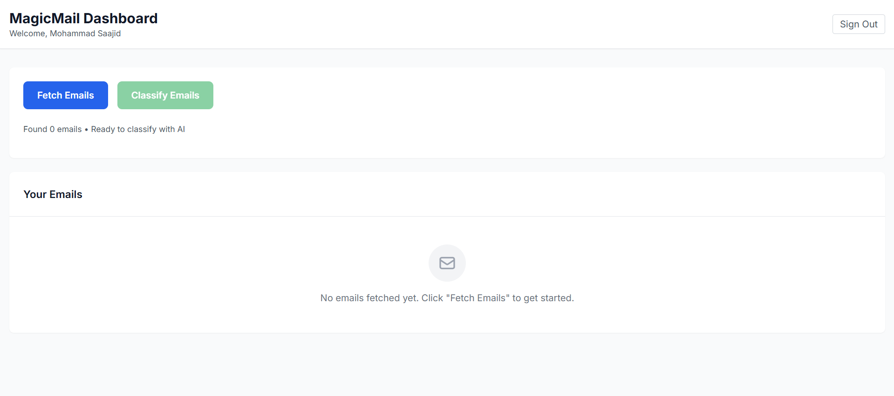
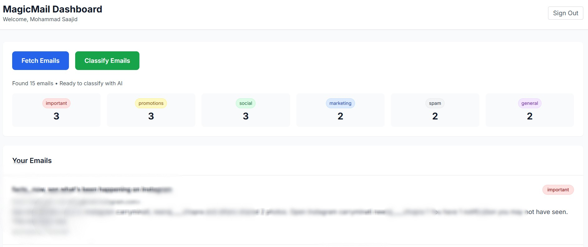
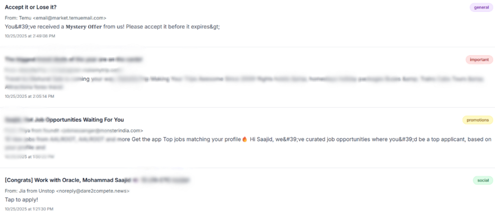

# 🎩 MagicMail Classifier - AI-Powered Email Organization

## Overview
MagicMail Classifier is a full-stack web application that allows users to log in using Google OAuth, fetch their Gmail emails, and classify them into different categories using OpenAI GPT-4o. The application provides intelligent email organization with real-time AI classification.

## Features
- **Google OAuth Authentication** - Secure login with Google accounts
- **Real Gmail Integration** - Fetch actual emails from your Gmail account
- **AI-Powered Classification** - Categorize emails using OpenAI GPT-4o
- **Six Smart Categories**: Important, Promotions, Social, Marketing, Spam, General
- **Modern Dashboard** - Clean, responsive interface with real-time updates
- **Privacy Focused** - Emails processed locally, never stored on servers

## Tech Stack
- **Frontend**: Next.js 14, React, TypeScript, Tailwind CSS
- **Backend**: Next.js API Routes
- **Authentication**: NextAuth.js with Google OAuth
- **APIs**: Gmail API, OpenAI API
- **State Management**: Zustand
- **Styling**: Tailwind CSS with custom components

## Prerequisites
- Node.js 18.0 or later
- Google Cloud Console account
- OpenAI API account

## Installation & Setup

### 1. Clone and Install
- git clone <your-repository-url>
- cd magicmail-classifier
- npm install

### 2. Environment Configuration

Create .env.local file in root directory:
GOOGLE_CLIENT_ID=your_google_client_id
GOOGLE_CLIENT_SECRET=your_google_client_secret
NEXTAUTH_URL=http://localhost:3000
NEXTAUTH_SECRET=any_random_string

### 3. Google OAuth Setup

- Go to Google Cloud Console
- Create project and enable Gmail API & Google+ API
- Configure OAuth consent screen (External user type)
- Add scopes: .../auth/gmail.readonly, .../auth/userinfo.email, .../auth/userinfo.profile
- Create OAuth 2.0 Client ID (Web application)
- Add authorized URIs:
- JavaScript origins: http://localhost:3000
- Redirect URIs: http://localhost:3000/api/auth/callback/google
- Add test users: your email

## 4. Run Application
bash
- npm run dev
- Open http://localhost:3000

## Project Structure: 

magicmail-classifier/

- app/
  - auth/                 # Authentication pages
  - dashboard/            # Main application dashboard
  - api/                  # API routes
    - auth/              # NextAuth configuration
    - gmail/             # Gmail API integration
    - classify/          # OpenAI classification
  - layout.tsx           # Root layout
- types/                  # TypeScript definitions
- lib/                    # Utility functions
- public/                 # Static assets

## API Endpoints
- GET /api/gmail - Fetch emails from Gmail API
- POST /api/classify - Classify emails using OpenAI
- GET/POST /api/auth/[...nextauth] - Authentication routes

## 🖼️ Project Demonstration

## Security Features
- OAuth 2.0 secure authentication
- API keys stored in browser localStorage only
- No email data stored on servers
- Encrypted session management
- CORS protection and secure headers

## How to Use
1- Enter OpenAI Key - Paste your API key on login page

2- Google Login - Complete OAuth authentication

3- Fetch Emails - Click to retrieve latest Gmail messages

4- Classify Emails - Click to categorize using AI

5- View Results - See emails organized into color-coded categories

